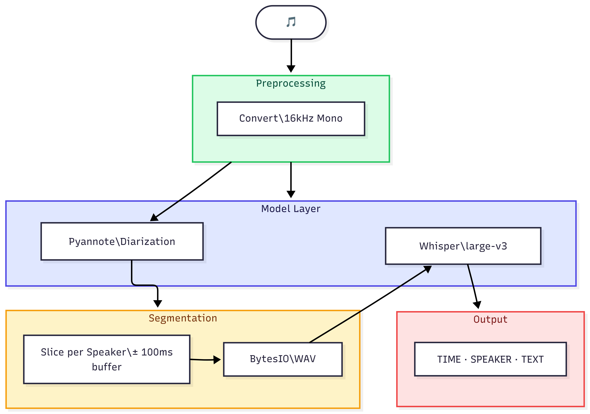

# Audio Diarization & Transcription

Automatically detects **who spoke** and **what they said** in any audio file.
Built with [Pyannote](https://github.com/pyannote/pyannote-audio) for speaker diarization and [Faster-Whisper](https://github.com/SYSTRAN/faster-whisper) for speech recognition.

---

## Architecture



---

## Output Example

```
================================================================================
TIME            | SPEAKER      | TEXT
================================================================================
0.5s-4.2s       | SPEAKER_00   | Good morning, can you tell me your full name?
4.8s-9.1s       | SPEAKER_01   | Yes, my name is Anvar Mexmonov.
================================================================================
```

---

## Installation

```bash
pip install torch torchvision --index-url https://download.pytorch.org/whl/cu128
pip install pyannote.audio
pip install faster-whisper
pip install pydub
```


ffmpeg is required by `pydub` to read and convert audio files (mp3, mp4, wav, etc.) under the hood.

```bash
# Windows
choco install ffmpeg

# Linux
sudo apt install ffmpeg

# Mac
brew install ffmpeg
```

---

## Hugging Face Setup

1. Create a free account at [huggingface.co](https://huggingface.co)
2. Accept the model license at [pyannote/speaker-diarization-3.1](https://huggingface.co/pyannote/speaker-diarization-3.1)
3. Generate a token at [huggingface.co/settings/tokens](https://huggingface.co/settings/tokens)
4. Paste it into `main.py`:
```python
HF_TOKEN = "your_token_here"
```

---

## Usage

1. Place your audio file in the project folder
2. Set your config in `main.py`:
```python
AUDIO_FILE = "your_audio.wav"   # your audio file
LANGUAGE   = "en"               # language code: en, uz, ru, etc.
```
3. Run:
```bash
python main.py
```
4. Find your transcript in `transcript.txt`

---

## Project Structure

```
audio-diarization/
├── main.py            
├── transcript.txt     
├── audio/             
├── requirements.txt
├── .gitignore
└── README.md
```

---

## Requirements

| Component | Requirement                |
|-----------|----------------------------|
| GPU       | CUDA-capable (recommended) |
| VRAM      | 6GB+ recommended           |
| Python    | 3.9+                       |
| OS        | Windows / Linux            |
